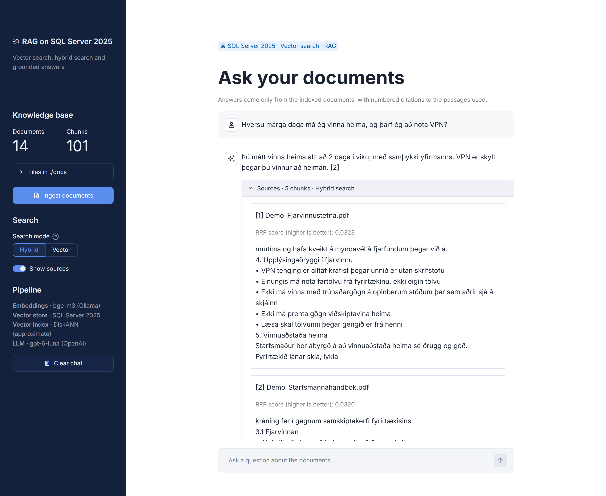

# RAG on SQL Server 2025


A small chat app that answers questions about a set of documents, using SQL Server 2025 as the vector database. I built it to try out the new vector features in SQL Server and to find out, by measuring, what actually makes the answers good.



The demo documents are 14 short policy documents (in Icelandic) for a made-up accounting firm. I generated them with an LLM and then reviewed and edited them. You can ask in Icelandic or English, and every answer cites the passages it used.

## How it works

```
ingest:  docs/ → 500-character chunks → bge-m3 embeddings → SQL Server (VECTOR(1024) column)

ask:     question → rewrite if it's a follow-up → embed → search SQL Server → top 5 chunks → LLM → answer with [n] citations
```

- **Embeddings**: `bge-m3` in Ollama, running locally. It's multilingual, which matters for Icelandic.
- **Search**: hybrid by default, combining a vector ranking with full-text search (`FREETEXTTABLE`) through Reciprocal Rank Fusion. A vector-only mode uses a DiskANN index through `VECTOR_SEARCH`.
- **LLM**: any OpenAI-compatible API. It's told to answer only from the retrieved passages and to say so when the answer isn't there.

## Getting started

You need Python 3.11+, [Docker Desktop](https://www.docker.com/products/docker-desktop/), [Ollama](https://ollama.com), the [ODBC Driver 18 for SQL Server](https://learn.microsoft.com/sql/connect/odbc/download-odbc-driver-for-sql-server), and an API key for an LLM (or a local model in Ollama).

```bash
cp .env.example .env              # add your LLM key and pick a SQL password
docker compose up -d              # SQL Server 2025 with Full-Text Search
ollama pull bge-m3                # the embedding model

python -m venv .venv
.venv\Scripts\activate            # macOS/Linux: source .venv/bin/activate
pip install -r requirements.txt
streamlit run app.py
```

Open http://localhost:8501, click **Ingest documents**, and ask something. To use your own documents, put them in `docs/` (pdf, txt, md or docx) and ingest again. To use another LLM provider, set `LLM_BASE_URL`, `LLM_API_KEY` and `LLM_MODEL` in `.env`; [`.env.example`](.env.example) has examples.

## Results

[`questions.csv`](questions.csv) has 120 test questions with known answers, and `python evaluate.py` scores both search modes on them. The held-out questions were written after all settings were frozen, so nothing was tuned to fit them.

| | Hybrid search (default) | Vector search |
|---|---|---|
| Correct answer, held-out questions | **95%** (18 of 19) | 89% (17 of 19) |
| Correct answer, tuning questions | 94% | 99% |
| Off-topic questions refused, held-out | 5 of 5 | 5 of 5 |

I wrote the questions myself with the documents in front of me, so treat these numbers as a sanity check rather than a benchmark.

## What I learned

- **The embedding model mattered most.** Switching from the English-focused `nomic-embed-text` to the multilingual `bge-m3` took correct answers from 81% to 97%.
- **Hybrid search needed an Icelandic stopword list.** SQL Server doesn't have one, so common words like "á" and "að" matched almost every chunk. A custom stoplist, plus fusing only the top 20 results from each ranking, took it from 84% to 95%.
- **Tuning numbers were too optimistic.** Vector search looked best on the tuning questions but dropped on held-out ones, while hybrid search held up. That's why hybrid is the default.
- **Plausible off-topic questions are the hard part.** They sit as close to the text as real ones, so a distance cut-off can't catch them. A stricter prompt could.
- **Follow-up questions need rewriting** into standalone questions before searching. That took them from 75% to 100%.
- **Some ideas didn't help**, like sentence-aware chunking, so I left them out.

## SQL Server 2025 notes

```sql
DECLARE @q VECTOR(1024) = CAST(CAST(? AS NVARCHAR(MAX)) AS VECTOR(1024));

SELECT c.source, c.content, v.distance
FROM VECTOR_SEARCH(TABLE = chunks AS c, COLUMN = embedding, SIMILAR_TO = @q,
                   METRIC = 'cosine', TOP_N = 5) AS v
ORDER BY v.distance;
```

- `SIMILAR_TO` only accepts a variable, and table columns are read through the table alias.
- A DiskANN index needs at least 100 rows (the demo gives 101 chunks). Below that, the app uses exact `VECTOR_DISTANCE` search.
- [`sql/sql_server_2025_examples.sql`](sql/sql_server_2025_examples.sql) has standalone examples of other new features: `AI_GENERATE_EMBEDDINGS`, JSON functions, regular expressions, fuzzy matching and graph tables.

## Project layout

```
app.py              Streamlit UI
rag/                config, database, embeddings, search and chat
evaluate.py         evaluation script
questions.csv       test questions (tuning and holdout)
tests/              unit tests (pytest, everything external mocked)
sql/                standalone T-SQL examples
docs/               demo documents
```

## Limitations

- The test set is small and self-written. Questions from real users would be a much better test.
- 101 chunks is just enough for DiskANN. You'd need thousands to see a real speed difference between approximate and exact search.

## License

[MIT](LICENSE)
