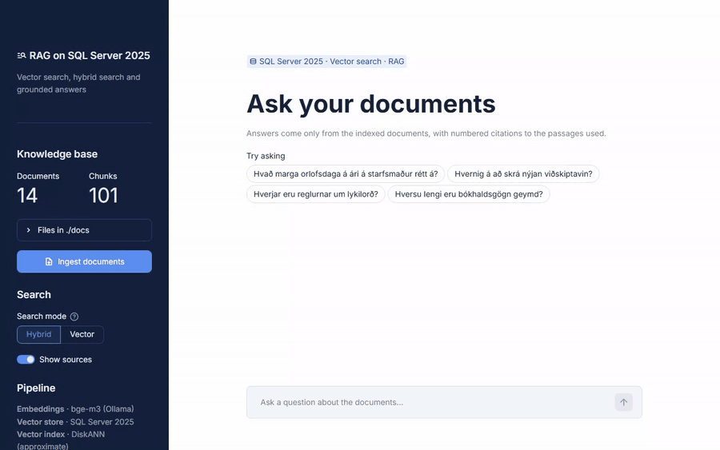

# RAG on SQL Server 2025


A small chat app that answers questions about a set of documents, using SQL Server 2025 as the vector database. I built it to try out the new vector features in SQL Server and to find out, by measuring, what makes the answers good. It's also how I'm working through the material for Microsoft's [DP-800](https://learn.microsoft.com/credentials/certifications/resources/study-guides/dp-800) exam (Developing AI-Enabled Database Solutions).



The demo documents are 14 short policy documents (in Icelandic) for a made-up company. I generated them with an LLM and reviewed them. You can ask in Icelandic or English, and every answer cites its sources.

## How it works

```
ingest:  docs/ → 500-character chunks → bge-m3 embeddings → SQL Server (VECTOR column)
ask:     question → embed → search SQL Server → top 5 chunks → LLM → answer with [n] citations
```

- **Embeddings**: `bge-m3` in Ollama, running locally. It's multilingual, which matters for Icelandic.
- **Search**: hybrid by default, combining vector search and full-text search. Vector-only search uses a DiskANN index.
- **LLM**: any OpenAI-compatible API, told to answer only from the retrieved passages.
- **Database**: the schema is a SQL Database Project in [`database/`](database), with the searches as stored procedures. The app connects with its own login that can only search and load documents.

## Getting started

You need Python 3.11+, [Docker](https://www.docker.com/products/docker-desktop/), [Ollama](https://ollama.com), the [ODBC Driver 18 for SQL Server](https://learn.microsoft.com/sql/connect/odbc/download-odbc-driver-for-sql-server), and an LLM API key.

```bash
cp .env.example .env          # add your LLM key and two SQL passwords
docker compose up -d          # start SQL Server
docker compose wait schema    # wait until the database is set up
ollama pull bge-m3

python -m venv .venv
.venv\Scripts\activate        # macOS/Linux: source .venv/bin/activate
pip install -r requirements.txt
streamlit run app.py
```

Open http://localhost:8501, click **Ingest documents**, and ask something.

## Try it in SQL

Connect with SSMS or VS Code to `tcp:localhost,1433` as `sa` (password in `.env`, with "Trust server certificate" checked). The database is called `SqlServerRag`. The [`sql/`](sql) folder has three scripts to run section by section, roughly following the topics in the DP-800 study guide:

| Script | What it covers |
|---|---|
| [`01-app-searches.sql`](sql/01-app-searches.sql) | The app's own searches: what's stored, vector search with and without the DiskANN index, full-text and hybrid search, the app login's permissions, and what each search costs in Query Store |
| [`02-design-and-develop.sql`](sql/02-design-and-develop.sql) | Constraints and sequences, the `json` type and JSON indexes, views, functions and triggers, CTEs and window functions, regular expressions, fuzzy matching, temporal, ledger, graph and in-memory tables, partitioning, columnstore, and error handling |
| [`03-secure-and-optimize.sql`](sql/03-secure-and-optimize.sql) | Row-Level Security (also in vector search), Dynamic Data Masking, column-level encryption, auditing, execution statistics, DMVs, isolation levels, Change Tracking for keeping embeddings in sync, and calling a model from T-SQL |

Scripts 2 and 3 work on a copy of the documents in a separate scratch database, so the app's database stays as it is.

## Results

I wrote 120 test questions with known answers. The held-out questions were written after all settings were frozen, so nothing was tuned to fit them. `python evaluate.py` runs them.

| | Hybrid search (default) | Vector search |
|---|---|---|
| Correct answer, held-out questions | **95%** | 89% |
| Correct answer, tuning questions | 94% | 99% |
| Off-topic questions refused, held-out | 5 of 5 | 5 of 5 |

I wrote the questions myself, so treat these numbers as a sanity check, not a benchmark.

## What I learned

- **The embedding model mattered most.** Switching to the multilingual `bge-m3` took correct answers from 81% to 97%.
- **Hybrid search needed an Icelandic stopword list.** SQL Server doesn't have one, and without it, words like "á" and "að" matched almost everything.
- **Tuning numbers were too optimistic.** Vector search looked best on the tuning questions but dropped on the held-out ones. That's why hybrid is the default.
- **Off-topic questions that sound plausible are the hardest.** A stricter prompt handled most of them.
- **DiskANN doesn't pay off on small data.** With 101 chunks it was slower than exact search, though it found 99% of the same results.

## Tests

```bash
pytest                  # unit tests
pytest -m integration   # tests against the real database
```

CI runs both on every push. It also builds the SQL project into a `.dacpac`, deploys it to SQL Server in Docker, checks the database for schema drift, and saves the `.dacpac` as a downloadable artifact.

## License

[MIT](LICENSE)
